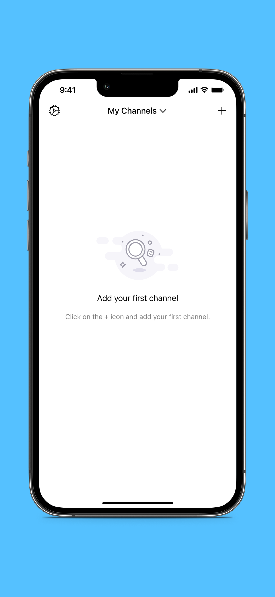

## Welcome to Follow App

Follow is a powerful app which tracks the number of followers to channels and informs you in real time.
The best thing about Follow is that you can keep track of more than 1 channel at once.
Our app will save you a lot of time and energy because you don’t have to log in to your account a couple of times in a day just to see your progress. Follow is also FREE, so download our app and try it now!  

### Features 
- Support dozens of sites
- Add your own channel and other people’s channels
- Get real time updates about the number of followers for each channel
- Minimalist design and user friendly interface
- and many more!

Do you want more features? Drop us an [email](mailto:billowstudio@gmail.com) to let us know and we will work hard to bring new features that will be useful for you.

### Support or Contact

Having trouble with Follow? Check out our [documentation](https://docs.github.com/categories/github-pages-basics/) or [contact support](mailto:billowstudio@gmail.com) and we’ll help you sort it out.
